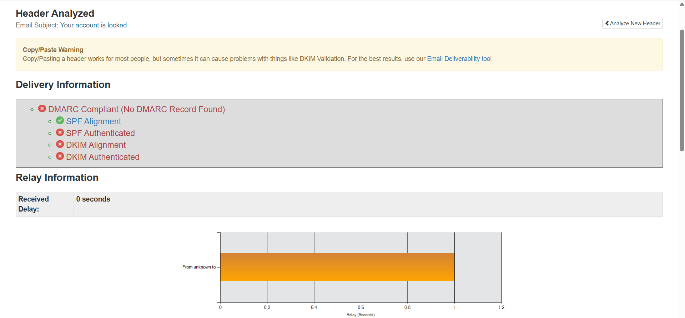
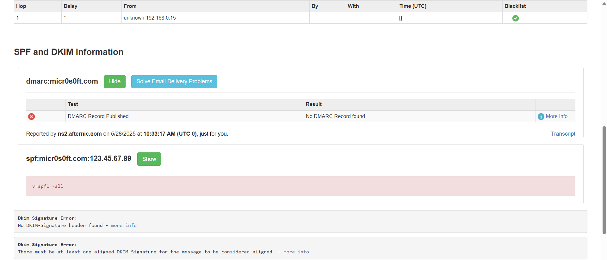
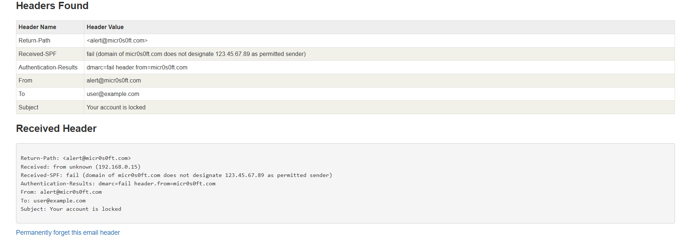

# Phishing-Email-Analysis
Phishing Email Analysis

## Objective
To identify phishing characteristics in a suspicious email by analyzing the sender, email content, and header information.

## Sample Phishing Email
From: alert@micr0s0ft.com  
Subject: Your account is locked

Message:
We detected unusual activity in your account. Please verify your account now by clicking this secure link:  
http://microsoft-support-login.com/verify

Failure to act will result in account suspension.

## Phishing Indicators Found
- Spoofed domain (micr0s0ft.com instead of microsoft.com)
- Urgent language pressuring the user
- Fake URL (not a Microsoft domain)
- Generic greeting and grammar issues
- Header shows SPF and DMARC failure

## Header Analysis
- SPF: fail (domain not authorized to send email)
- DMARC: fail
- Return-path mismatch
- IP address not related to Microsoft

## Tools Used
- Google Message Header Analyzer
- Manual inspection

## Key Learnings
- How to detect spoofed emails
- Use of header analysis tools
- Recognizing phishing patterns

